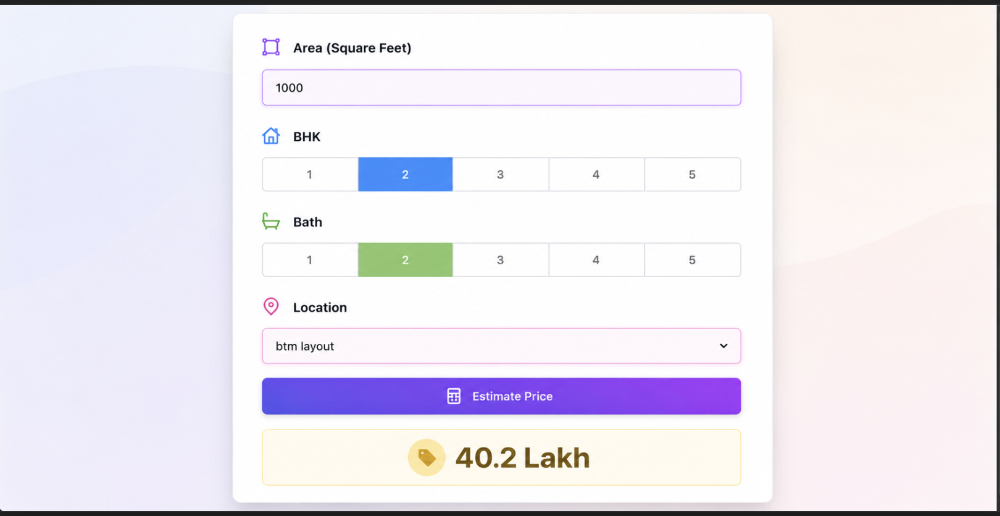

# Bangalore House Price Prediction



## Overview
This project is an end-to-end Machine Learning web application that predicts house prices in Bangalore based on various features such as location, total square footage, number of bathrooms, and BHK (Bedrooms, Hall, Kitchen).

## Project Structure
The project consists of three main components:
1. **Machine Learning Model**: The `EstatePricePrediction.ipynb` notebook contains the data science workflow. It covers data cleaning, outlier detection, feature engineering, and training a Linear Regression model using GridSearchCV for hyperparameter tuning. The final model is exported to a pickle file.
2. **Backend Server**: Built using Python and Flask (`server.py` and `util.py`). The backend loads the trained machine learning model and serves HTTP requests to predict the house price.
3. **Frontend UI**: Built with HTML, CSS, and vanilla JavaScript (`app.html`, `app.css`, `app.js`). It allows users to input the required details (BHK, area, bathrooms, location) and displays the predicted price.

## Features
- **Data Preprocessing**: Handling NA values, feature engineering (price per sqft), and dimensionality reduction for locations with fewer data points.
- **Outlier Removal**: Removing extreme values based on business logic and standard deviation rules.
- **Model Training**: Utilizing K-Fold cross-validation and GridSearch to find the best model (Linear Regression, Lasso, Decision Tree).
- **Interactive UI**: A clean, simple web interface to input parameters and get immediate predictions.

## Screenshots


## Setup and Installation

### Prerequisites
- Python 3.x
- pip (Python package manager)
- A modern web browser

### Backend Setup
1. Clone the repository and navigate to the project directory.
2. Install the required Python packages:
   ```bash
   pip install flask numpy scikit-learn
   ```
3. Ensure that the model artifacts (`Bengalore_House_Data.pickle` and `columns.json`) are placed inside the `artifacts/` directory, as the Flask server expects them to be there.
4. Run the Flask server:
   ```bash
   python server.py
   ```
   The backend server will start running on `http://127.0.0.1:5000`.

### Frontend Setup
1. Open the `app.html` file in your preferred web browser.
2. Ensure the Flask server is running in the background.
3. Select the desired location, input the area, BHK, and number of bathrooms, then click on "Estimate Price" to see the prediction.

## Dataset
The dataset used for this project is `Bengaluru_House_Data.csv`, which contains historical data of house prices in Bangalore with various features.

## Technologies Used
- **Python**: Core programming language.
- **Pandas & NumPy**: For data manipulation and mathematical operations.
- **Scikit-Learn**: For building and evaluating the machine learning models.
- **Flask**: To create the backend API.
- **HTML/CSS/JavaScript**: For building the interactive user interface.
